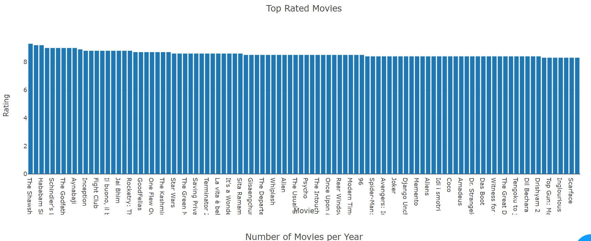
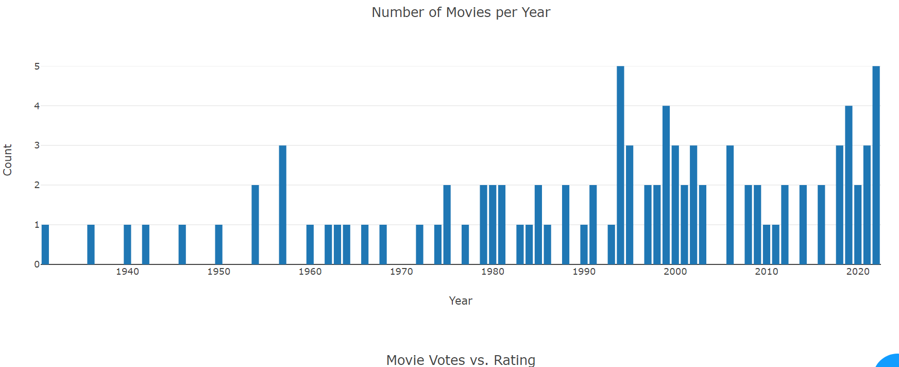
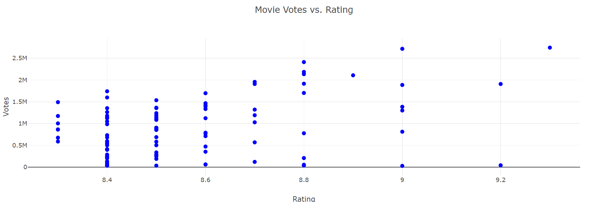
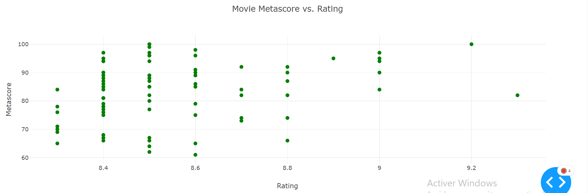

# IMDB-Dashboard

This is a web application built using Dash framework that displays information and visualizations about the top rated movies from IMDb.

## Features

- Scrapes data from IMDb website to gather information about top rated movies.
- Provides visualizations of movie ratings, number of movies per year, and relationships between ratings, votes, and metascores.
- Allows users to click on a movie in the rating graph to view detailed information about the selected movie.

## Installation

1. Clone the repository or download the source code.
2. Install the required dependencies using the following command:

## Usage

1. Open a terminal or command prompt and navigate to the project directory.
2. Run the following command to start the application:
3. Open a web browser and enter the following URL: http://127.0.0.1:8050/
4. The Top Rated Movies Dashboard will be displayed in the web browser.

## Contributing

Contributions are welcome! If you have any ideas, suggestions, or bug reports, please create an issue or submit a pull request.

## Acknowledgements

This project was inspired by the need to explore and visualize movie data from IMDb. Special thanks to IMDb for providing the data and Dash for the powerful web framework.
